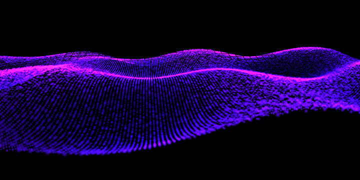

# PhotoPrism — AI Wallpaper Generator

Generate AI-inspired wallpapers with rich neural gradients, aurora waves, and spectrum dots right in your browser at [**https://dl.photoprism.app/wallpaper/**](https://dl.photoprism.app/wallpaper/).

## Features

- 🎨 Multiple render styles ([Soft Gradient](https://dl.photoprism.app/wallpaper/#softGradient), [Particle Waves](https://dl.photoprism.app/wallpaper/#particleWaves), [Spectrum Dots](https://dl.photoprism.app/wallpaper/#spectrumDots), [Aurora Blurs](https://dl.photoprism.app/wallpaper/#auroraBlurs), [Gradient mesh](https://dl.photoprism.app/wallpaper/#gradientMesh), [Neural Curves](https://dl.photoprism.app/wallpaper/#neuralCurves), [Bokeh Bloom](https://dl.photoprism.app/wallpaper/#bokehBloom), [Layered Waves](https://dl.photoprism.app/wallpaper/#layeredWaves), [Snowflakes](https://dl.photoprism.app/wallpaper/#snowflakes)).
- 🌈 Dynamic color palettes (shuffle or edit any number of swatches; palettes align with PhotoPrism’s homepage gradients).
- 🖥️ Resolution presets covering HD through 8K, plus a custom size option with validation.
- ⬇️ One-click download in PNG or JPEG; filenames capture style, resolution, and colors. On supported browsers we open a save dialog (File System Access API) or iOS share sheet so “Save Image” drops wallpapers straight into Photos.
- 📱 High-DPI aware renders: portrait sizes (width < height) receive a simulated device pixel ratio so particles stay crisp on mobile; iOS caps the multiplier to keep Safari stable during palette shuffles.
- 🧵 WebGL render queue: Three.js-powered styles ([Particle Waves](https://dl.photoprism.app/wallpaper/#particleWaves), [Spectrum Dots](https://dl.photoprism.app/wallpaper/#spectrumDots), [Snowflakes](https://dl.photoprism.app/wallpaper/#snowflakes)) render via offscreen canvases with serialized draw calls to avoid 2D/WebGL conflicts.
- ♿ Keyboard-friendly controls, accessible labels, and consistent button sizing.

[](https://dl.photoprism.app/wallpaper/#particleWaves)

## Getting Started

This project expects Node.js 20.10+ and npm 10.5+. Install dependencies with:

```bash
npm install
```

### Development Server

```bash
npm run dev
```

Visit the printed local URL (default http://localhost:5173/) to interact with the app.

### Quality Checks

```bash
npm run lint     # ESLint (flat config, ESLint 9)
npm run format   # Prettier + Tailwind class sorting
```

### Production Build

```bash
make build
```

The build step runs `vite build` with `vite-plugin-singlefile` and writes the self-contained output to `dist/index.html`.

## Project Structure

- `index.html` — Vite HTML entry and metadata.
- `src/main.js` — Application bootstrap.
- `src/app/index.js` — UI state, canvas orchestration, download logic.
- `src/app/renderers.js` — Style registry and metadata.
- `src/app/renderers/` — Individual renderer modules. WebGL styles (Particle Waves, Spectrum Dots, Snowflakes) use Three.js, accept `{ pixelRatio }`, render to an offscreen canvas, and dispose all geometries/materials before returning.
- `src/lib/` — Shared helpers (color math, palettes with per-line hex definitions, noise, math utilities).
- `src/styles.css` — Tailwind layers with the PhotoPrism-neutral dark theme (12px container radius, 8px element radius, system font stack).
- `vite.config.js` — Single-file bundling configuration.
- `tailwind.config.js` / `postcss.config.cjs` — Tailwind + PostCSS setup.
- `eslint.config.js` / `prettier.config.cjs` — Lint/format tooling.

## License

Distributed under the MIT License. See [LICENSE](LICENSE) for details.
